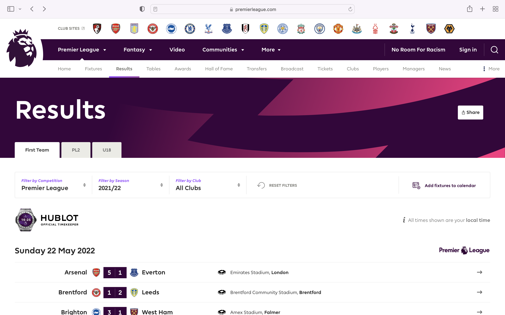
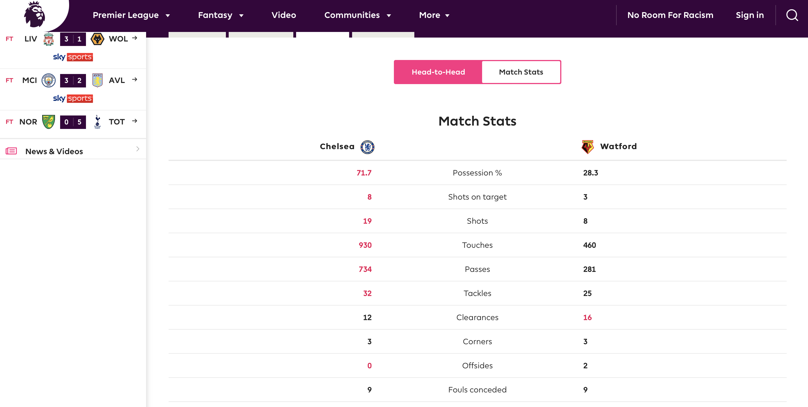
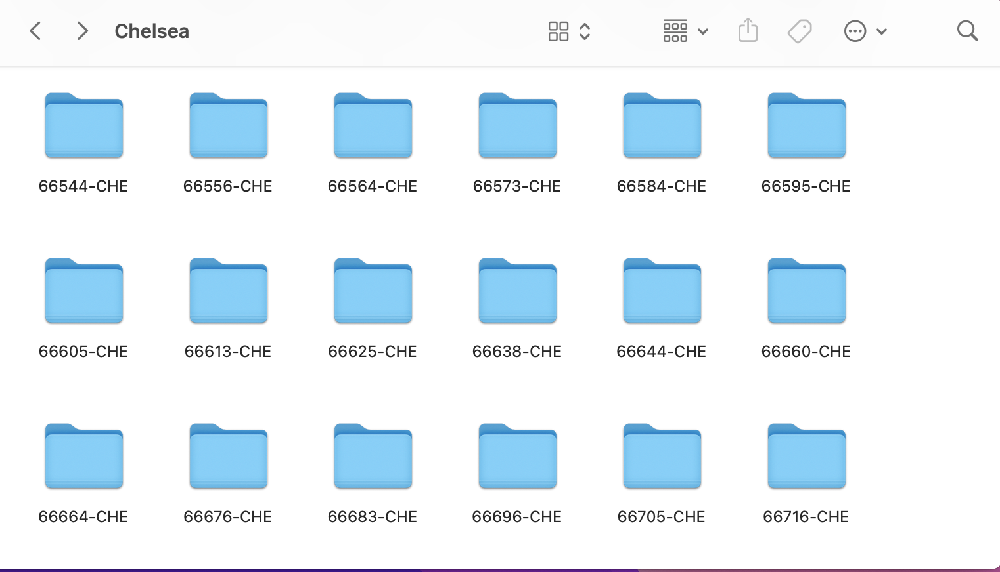
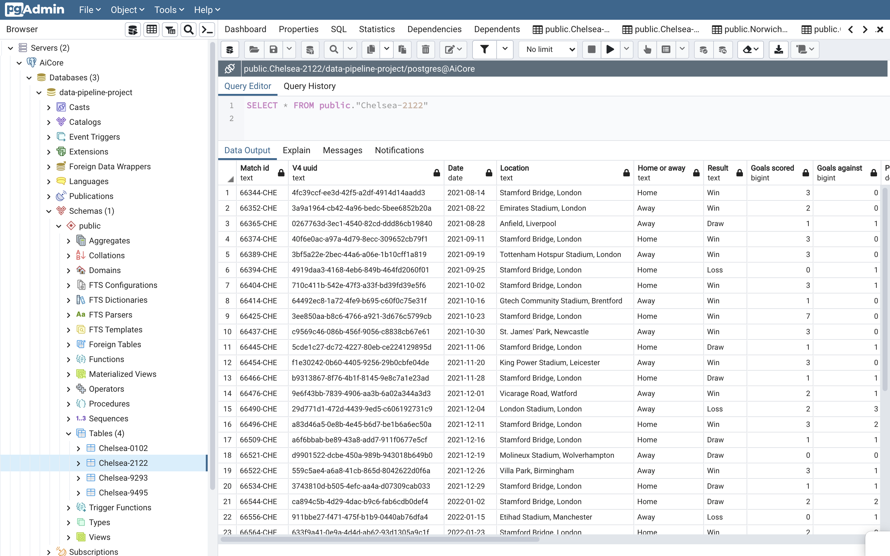
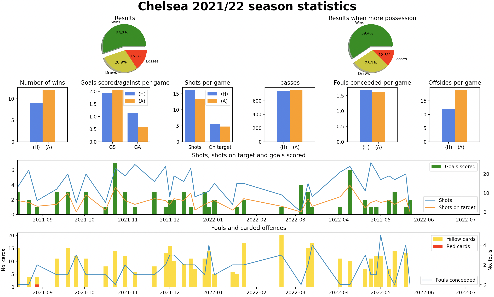
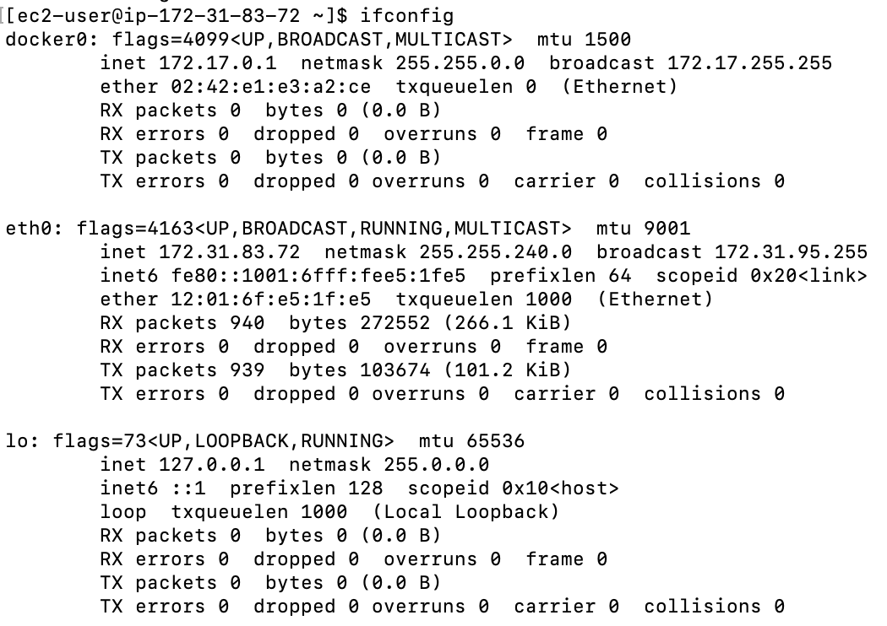
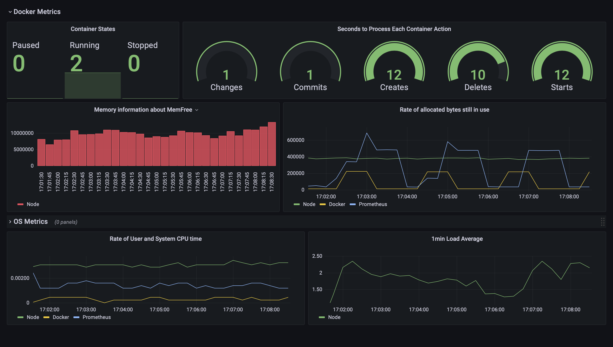

# Data Collection Pipeline Project

> My third project for AiCore. Webscraping the match statistics of a club from any season from the official Premier League website.

## Milestone 1: Deciding the website to scrape

- The aim of this project is to gain a deeper understanding as to how a clubs match stats vary with factors such as the location and result of the game.

- The Premier League official website has been selected is due to the reliability of the information shown on each game. It stores information from every team's fixtures from the past 30 seasons therefore providing a very large quanitity of data for the program to scrape from.

- They Python package ```Selenium``` will be imported to use it's WebDriver as a means to automate web browser interaction. Google Chrome will be the browser used.

-  Git branches will be used locally before being commited and pushed to the remote repository via pull requests.

- Logging will be used to track how the events unfold as the program runs. This is because logging provides several advantages over simple ```print``` statements:
    - Far easier to see where and when the log has been made.
    - The ability to log to files, sockets and more simultaneously.
    - Logs can be differentiated based on severity (```DEBUG```, ```INFO```, ```WARNING```, ```ERROR``` and ```CRITICAL```)
    The logger is configure to show all logs with a severity of ```INFO``` and above.
    ```python
    logging.basicConfig(level = logging.INFO)
    ```

- A requirements.txt file is set up with ```pip freeze``` formatted so only the package version is shown.
```
pip list --format=freeze > requirements.txt
```

<p align="center">
  
</p>

> The results page with fixture list.

## Milestone 2: Finding the URL for each game

- The class ```PremierLeagueScraper``` is created with the WebDriver as an attribute, to allow the user to dictate which browser they want to use. 

- ```self.club``` and ```self.year``` attributes are created from user inputs in the terminal, and verified as bein valid by checking the respective dictionary and list in the file ```valid_inputs.py```. ```self.URL``` is the URL of the Premier League website's results page.

- Class methods are added to open the page on Chrome, accept all cookies, close the ad window if required and select the season to be inspected from the dropdown menu. Then, the ```get_fixture_link_list()``` method will extract the links to each of the club to be inspected's matches from the list of fixtures.

- To select the season to be inspected from the dropdown menu, the ```ActionsChains``` module is used to scroll down to the required season if it is not shown.
```python
desired_season = self.driver.find_element(By. XPATH, f'//li[contains(text(),"{self.year}")]')
    actions = ActionChains(self.driver)
    actions.move_to_element(desired_season).perform()
    desired_season.click()
```

- The ```scroll_to_bottom()``` method is implemented as the page only displayed the first few games without being scrolled. More games get loaded automatically as the page is scrolled.

- Where possible, the links are found using Selenium's ```.find_element(By. CSS_SELECTOR)``` method to locate the href attribute containing the URL of each fixture. i.e.:
```python
fixture_list = self.driver.find_element(By.XPATH, '//section[@class="fixtures"]')
            home_games = fixture_list.find_elements(By.XPATH, f'//li[@data-home="{self.club}"]')
            away_games = fixture_list.find_elements(By.XPATH, f'//li[@data-away="{self.club}"]')
```

- The method ```Expected Conditions``` is imported from the package ```selenium.webdriver.support``` as ```EC``` to allow us to wait for certain conditions to be met before we execute a command. For example, in order for us to wait until the fixture list has been loaded before we start scrolling, we use the following method. The second parameter in ```WebDriverWait``` is the length of time before the program will throw a ```TimeoutError``` if the expected conditions are still not met.

```python
WebDriverWait(self.driver, 10).until(EC.presence_of_element_located((By.XPATH, '//*[@class="fixtures__matches-list"]')))
```

- These links are appended to a list which can then be iterated through to get the data required from each game.

- The class was initialised within the ```if __name__ == '__main__'``` block, so that it only runs if the file ```scraper.py``` is run directly rather than on any import.
```python
if __name__ == '__main__':
    premierleague = Scraper(driver=webdriver.Chrome())
    premierleague.run_crawler()
```

> Insert screenshot of what you have built working.

## Milestone 3: Retrieving data from each page
- The method ```scrape_stats()``` is introduced in order to extract the date, location, result and match stats a particular link (one match).

- A unique 9 character Match ID is created from the unique match number and abbreviated team name separated with a dash.
    - The match number was lifted from the last 5 characters of the URL of each link.
    - The dictionary in ```valid_inputs``` contains the shortened name of each club as the key.

- A Version 4 universally unique identifier (V4 UUID) is also generated from Python's ```uuid``` package and assigned to each match. V4 UUIDs are randomly generated 32 character, unlike previous versions, and contain 32 characters making them unique for the practical purposes. The probability of duplicates is negligable.

- These raw statistics are then converted into a list, before finally being turned into a dictionary by the ```create_dictionary()``` method. This dictionary contained information on:
    - Match ID
    - V4 UUID
    - Match date
    - Location
    - Home/Away
    - Result
    - Goals scored
    - Goals conceeded
    - Possession
    - Shots on target
    - Shots 
    - Touches
    - Passes
    - Tackles
    - Clearances
    - Corners
    - Offsides
    - Yellow cards
    - Red cards
    - Fouls conceeded

<p align="center">
  
</p>

> The majority of the data is lifted from text in this table, before being being cleaned and put into a dictionary.

- Finally, this data is saved locally in the directory ```raw_data```. Each sub-directory named after the match ID containing a ```data.json``` file with this information in the form of a dictionary. If the directory for the match does not exist, the method will create a new one and if the file already exists, it will simply overwrite it. 
```python
def save_data_locally(self, match_id, raw_stats):
        path = f'/Users/asadiceccarelli/Documents/AiCore/Data-Collection-Pipeline/raw_data/{self.club}/{match_id}'
        if not os.path.exists(path):
            os.makedirs(path)
        json_str = json.dumps(raw_stats)
        with open(f'{path}/data.json', 'w') as outfile:
            outfile.write(json_str)    
```

- For example, the ```data.json``` file for one of Chelsea's match stats from the season 2019/20 will be stored in the directory ```Chelsea/46613-CHE```.

<p align="center">
  
</p>

> The directory containing Chelsea's match data.

## Milestone 4: Refining and Testing

- Docstrings are added to the ```PremierLeagueScraper``` class and all of its methods, using the Google format. These are much more easily accessed using the ```__doc__``` attribute or the built-in ```help()``` function, in comparison to regular ```#``` comments.

- Several methods are worked upon and rewritten, making these areas clearner or more efficient. 

- Although the majority of the methods used will not be public, several methods of the scraper class have been tested using the ```unittest``` module as a way to learn the basics of unit testing.. This is to ensure that all the individual units of the code work correctly.

- A new file ```test.py``` has been created to hold these unit tests, with a test class ```PremierLeagueScraperTestCase(unittest.TestCase)```. The test class is created as we are using the same intance of the class for each test, so it saves having to rewrite it each time.

- The class is initialsed using the ```setUp()``` method...

```python
def setUp(self):
        self.pl = PremierLeagueScraper(driver=webdriver.Chrome())
```

- ... and finished with the ```tearDown()``` method.

```python
def tearDown(self):
        self.pl.close_browser()
        del self.pl
```

- The 7 tests take around 300 seconds to run. There is a slight issue with the ```scroll_to_bottom()``` method due to the page not loading fast enough, however more times than not the test passes. A ```while``` loop to refresh the page and try again if all fixtures are not loaded properly and the driver option ```options.add_argument('--start-maximized')``` have been added to avoid this.

## Milestone 5: Scalably storing the data

- An Amazon Simple Storage Service (S3) is a data lake which is used to store files on the Amazon Web Service (AWS) server. The bucket ```premier-league-bucket``` has been created and the ```user_inputs()``` method gives the user the option to store the ```data.json``` files locally, in the cloud or both has been added. This is achieved using the AWS software development kit (SKD) ```boto3```.

```python
s3_client = boto3.client('s3')
        s3_client.upload_file(f'raw_data/{self.club}-{self.year[-5:-3]}{self.year[-2:]}/{match_id}/data.json', 'premier-league-bucket', match_id)
```

> This would upload a file to the S3 bucket with the match ID as the reference using ```boto3```.

- Amazon Relational Database Service (RDS) allows us to create a highly scalably database in the cloud. First, a virtual network is established to limit the range of IP addresses that can be used to access this service. Then, the database ```date-pipeline-project``` is created with PostgreSQL and accessed using pgAdmin 14. The function ```upload_to_sql()``` is created in the ```RDS_access.py``` file to download the files containing the data for the club being inspected from the S3 bucket, create a dataframe using pandas and upload to the RDS database using ```sqlalchemy```.

```python
DATABASE_TYPE = 'postgresql'
    DBAPI = 'psycopg2'
    HOST = 'aicore-db.ckoq1wsuhqob.us-east-1.rds.amazonaws.com'
    USER = 'postgres'
    PASSWORD = '**********'
    DATABASE = 'data-pipeline-project'
    PORT = 5432
    engine = create_engine(f"{DATABASE_TYPE}+{DBAPI}://{USER}:{PASSWORD}@{HOST}:{PORT}/{DATABASE}")
```
> Creating the RDS engine using ```sqlalchemy```.

<p align="center">
  
</p>

> An SQL table showing the data from Chelsea's 2021/22 season.

## Milstone 6: Preventing rescraping and getting more data

- To prevent rescraping, an ```if``` statement is added to the ```run_crawler``` method which checks to see if the RDS database to see if there is already information on the inputted club and year. If no data exists then the program will begind scraping and gathering the required information. If the database already contains this data, then the message ```'RDS database already contains data on this club from this season.'``` will be outputted in the terminal.

- To check that the scraper can run for extended periods of time, a simple ```for``` loop is introduced as a test. This contains a list of 4 clubs which the program iterates through to ensure it can process larger quanitites of data without crashing. If the program can run this, it would be scraping data from 152 links and uploading these entries to S3 and the RDS database, and so it is unlikley to have a problem running for even longer periods.

## Milestone 6.5: Using the data to create graphs

- A new class ```CreateGraphs``` is created. This connects to the RDS database using ```sqlalchemy``` in the initialisation of the class and retrieves a dataframe of a club's season's stats using pandas.
```python
def __init__(self, club, year):
    self.club = club
    self.year = year
    self.connection = rds_connect().connect()
    self.query = f'SELECT * FROM public."{self.club}-{self.year[-5:-3]}{self.year[-2:]}" ORDER BY "Date"'
    self.query_result = self.connection.execute(self.query)
    self.values = self.query_result.fetchall()
```

- Using the ```matplotlib``` package, several graphs were plotted to show:
    - A pie chart to show the results over the season and another only including games where the club being inspected had more possession.
    - Bar charts to show goals, shots, passes, fouls and offsides both at home and away.
    - A twin x-axis graph showing the shots and shots on target as line graphs as a function of time to be compared with a bar chart of the goals scored.
    A twin x-axis graph showing the fouls conceeded as a line graph as a function of time to be compared with bar charts of yellow/red cards.

<p align="center">
  
</p>

> The program outputs all the graphs on one page using ```GridSpec```.

## Milestone 7.1: Containerising the scraper

- Docker is used to containerise the program so that it can be run on any OS. This container holds the application and all dependencies in a single self-contained environment.

- To run a scraper in a docker container, it must first be able to complete all the necessary tasks in 'headless mode' i.e. without the GUI. 
```python
options = Options()
    options.add_argument('--headless')
    premierleague = PremierLeagueScraper(driver=webdriver.Chrome(options=options))
```

- First, a Docker image, which is the template for the container, is 'built' using a ```Dockerfile``.

- The base image ```python:3.8-slim-buster``` is used which is a paired down version of the full image, meaning the image itself will take up less disk space.
```python
FROM python:3.8-slim-buster
```

- In order to run the scraper inside the container, both Google Chrome and Chromedriver must be installed inside the image.
  - This is done by using ```wget``` for Chrome....
  ```python
  RUN wget -q -O - https://dl-ssl.google.com/linux/linux_signing_key.pub | apt-key add -
  RUN sh -c 'echo "deb [arch=amd64] http://dl.google.com/linux/chrome/deb/ stable main" >> /etc/apt/sources.list.d/google-chrome.list'
  RUN apt-get -y update
  RUN apt-get install -y google-chrome-stable
  ```

  - And for Chromedriver.
  ```python
  RUN apt-get install -yqq unzip
  RUN wget -O /tmp/chromedriver.zip http://chromedriver.storage.googleapis.com/`curl -sS chromedriver.storage.googleapis.com/LATEST_RELEASE`/chromedriver_linux64.zip
  RUN unzip /tmp/chromedriver.zip chromedriver -d /usr/local/bin/
  ```

- ```pip``` is used to update itself to the latest version and install the required packages.
```python
RUN pip install --upgrade pip
RUN pip install -r requirements.txt
```

- All files in the ```Data-Collection-Pipeline``` directory are copied into the image using the ```COPY``` command.
```python
COPY . .
```

- Finally to execute the program when the image is run, the ```CMD``` command is used.
```python
CMD ["python3", "project/scraper.py"]
```

- Now, to build up the image ```docker build -t scraper:latest .``` is run from the CLI. This will build up a the image with the name ```scraper``` and the tag ```latest```.

- A ```Docker volume``` is created to allow data to persist after a container is exited by connecting a file system on the host operating system to a virtual file system in the container. This is done with ```docker volume create PL-graphical-data```. Using this, the user can save the graphs onto their local machine after the container has run.

- A ```.env``` file is set up to securely store our environment variables which will the user can alter.
```
club=Man Utd
season=1994/95
rds_password=********
aws_access_key_id=***********
aws_secret_access_key=****************
```

- The image is run directly from the CLI.
```
docker run -it --rm \
-v premier-league-volume:/data-collection/graphical-data \
--env-file ./.env \
asadiceccarelli/premier-league-scraper:v1
```
  - The ```-it``` flags run the image interactively whilst keeping the STDIN open.
  - The ```--rm``` will remove the container after it has been exited.
  - The ```-v``` tag binds a mount to a volume, in this case binding the mount created inside the ```graphical-data``` directory to ```PL-volume```.
  - The ```--env-file``` tag indicates where to find the list of environment variables.

  - The ```premier-league-scraper``` image is then pushed to Dockerhub.

## Milestone 7.2: Running the scraper on a cloud computer

- An Elastic Cloud Computing (EC2) instance is set up using AWS to run the program on what is essentially a remote computer.

- First a key-pair is set up with a ```.pem``` extention and it's mode altered to read-only permission from the terminal.
```
chmod 400 /Users/asadiceccarelli/Documents/AiCore/aicorekey.pem
```

- An security group is then created for the EC2 instance with the inbound rules:
  - HTTP: Anywhere IPv4
  - HTTPS: Anywhere IPv4
  - SSH: My IP

- This instance will utilise the ```Amazon Linux 2 AMI``` Amazon Machine Image (AMI) and the ```t2-micro``` instance type. The instance is then connected to with the command:
```
ssh -i /Users/asadiceccarelli/Documents/AiCore/aicorekey.pem ec2-user@<public-dns>
```

Finally, the ```Data-Collection-Pipeline``` directory is copied to the EC2 instance.
```
scp -i /Users/asadiceccarelli/Documents/AiCore/aicorekey.pem -r </path/DataCollection-Pipeline> ec2-user@<public-dns>:~/
```

- Dockker is then installed in this instance and the ```ec2-user``` is added to the ```docker``` group so that commands can be executed without the neeed for ```sudo```.
```
sudo yum update -y
sudo amazon-linux-extras install docker
sudo service docker start
sudo systemctl enable docker
sudo usermod -a -G docker ec2-user
```

- The ```premier-league-scraper``` image is then pulled from Dockerhub before being run again to ensure it successfully works within this EC2 instance.
```
docker run -it --rm -v premier-league-volume:/data-collection/graphical-data --env-file ./.env asadiceccarelli/premier-league-scraper:v1
```

- The graphical data is saved in the Docker volume ```premier-league-volume``` in the EC2 instance.


## Milestone 8: Monitoring and alerting

- First the Prometheus image is pulled from Dockerhub using ```docker pull prom/prometheus```. Then the image is run using a ```prometheus.yml``` file.

```
docker run --rm -d \
    --network=host \
    --name prometheus\
    -v /home/ec2-user/Data-Collection-Pipeline/prometheus.yml:/etc/prometheus/prometheus.yml \
    prom/prometheus \
    --config.file=/etc/prometheus/prometheus.yml \
    --web.enable-lifecycle 
```

- To get Prometheus to track Docker, Docker's configuration is edited to that Prometheus knows from which address to collect the metrics. This is done by editing the ```daemon.json``` file. The IP address corresponding to Docker can be found by running ```ifconfig -a```.

<p align="center">
  
</p>

> The IP address is found from ```inet``` under ```docker0```.

```
{
    "metrics-addr" : "172.17.0.1:9323",
    "experimental": true,
    "features": {
    "buildkit": true
    }
}
```
> The ```daemon.json``` file should look like this.

- ```Node exporter``` is a single static binary that is downloaded and run straight from the workstation and allows us to track metrics from our local OS system.
```
wget https://github.com/prometheus/node_exporter/releases/download/v1.1.2/node_exporter-1.1.2.linux-amd64.tar.gz
tar xvfz node_exporter-1.1.2.linux-amd64.tar.gz
rm node_exporter-1.1.2.linux-amd64.tar.gz
```

- This is run using ```./node_exporter-1.1.2.linux-amd64/node_exporter```.

- Using these three endpoints as points to scrape (```Prometheus```, ```Docker``` and ```Node```), these image are run in detached mode (```-d``` flag) and their metrics displayed at ```<ec2 public IP>:9090```. However, to visualise them in a more user-friendly manner, Grafana will be used.

- Setting up Grafana required very few steps using ```homebrew```. Grafana can then be accessed at ```localhost:3000```.
```
brew update
brew install grafana
brew services start grafana
```

- When adding Prometheus as a data source, the URL used is ```<ec2 public IP>:9090```.

<p align="center">
  
</p>

> The metrics collected from running the ```premier-league-scraper``` image once for one club.

## Milestone 9: Setting up a CI/CD pipeline for the docker image

- Continuous Integreation (CI) is a way of integrating software changes from multiple contributors. This consists of:
  - Accessing code quality (code assessments and/or reviews).
  - Accessing adherence to the project's best practices.

- Continuous Deployment/Delivery (CD) involves testing that production code is always tested/bug-free and ready to be deployed automatically. This consists of:
  - Checking chanegs against integration tests.
  - Testing every feature that is supposed to be merged.
  - N.B. Continuous Delivery approach may not be suitable for all projects.

- Github Actions aid in creating a CI/CD pipeline as it enables the creation of workflows that can perform a certain action every time a designated event occurs. Here, a simple worflow has been created to build and push the updated Docker image wehenever there is a push to the ```main``` branch of the repository.

- First, my Docker ID, ```asadiceccarelli``` and a newly generated Personal Access Token (PAT) was added as an encrypted environment secret in GitHub.

- Then, the workflow was set up in the ```github_registry.yml``` as follows.
```yml
name: CI

on:
  push:
    branches: [ "main" ]

jobs:
  build:
    runs-on: ubuntu-latest

    steps:
      -
        name: Checkout 
        uses: actions/checkout@v2
      -
        name: Login to Docker Hub
        uses: docker/login-action@v1
        with:
          username: ${{ secrets.DOCKER_HUB_USERNAME }}
          password: ${{ secrets.DOCKER_HUB_ACCESS_TOKEN }}
      -
        name: Set up Docker Buildx
        uses: docker/setup-buildx-action@v1
      -
        name: Build and push
        uses: docker/build-push-action@v2
        with:
          context: .
          file: ./Dockerfile
          push: true
          tags: ${{ secrets.DOCKER_HUB_USERNAME }}/premier-league-scraper:latest
```

- This was confirmed to work after commiting this file to the ```main``` branch, and checking Dockerhub to see the latest version of the image ```premier-league-scraper``` pushed.

- A CronJob creates a Job which can be scheduled to run on a repeating schedule. Whilst this coudl be set up to run on the EC2 instance, and would be useful to many data scraping projects, it does not make much sense this feature to be included here. This is because the data for each season is only updated on a yearly bases, unlike most other data scraping programs which scrape from sites uploaded new products/data on almost a daily basis.